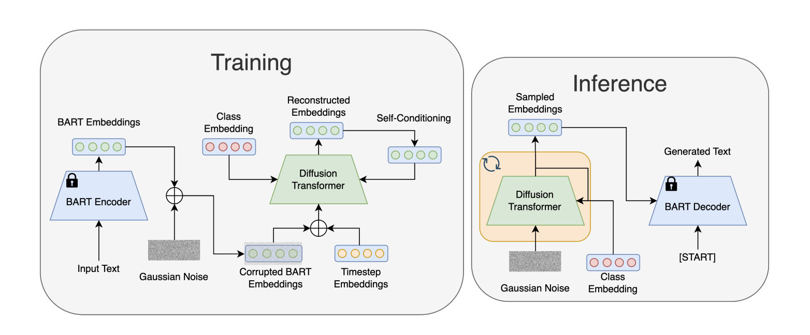

# latent-diffusion-for-language-generation

Figure from the original paper.

Unofficial implementation of Latent Diffusion for Language Generation (LD4LG)

This is an unofficial implementation of [LD4LG](https://arxiv.org/abs/2212.09462). For the official implementation, please refer [here](https://github.com/justinlovelace/latent-diffusion-for-language).

# :hammer_and_wrench: Setup
If you are using [poetry](https://github.com/python-poetry/poetry), run the following command to install required dependencies.
```bash
poetry install
```

Next, activate your virtual environment.
```bash
poetry shell
```

You can find more details about the required packages in `pyproject.toml`.

After that, initialize an [🤗Accelerate](https://github.com/huggingface/accelerate/) environment with:

```bash
accelerate config
```

Alternatively, you can set up a default Accelerate configuration without answering questions about your environment using:

```bash
accelerate config default
```


# :rocket: Run
## LD4LG Training
This repository allows you to train LD4LG on several datasets using the following commands:
```bash
accelerate launch scripts/train.py dataset=<dataset_name>
```

Since we are using the [Hydra](https://hydra.cc/) library, please follow the specifications for runtime arguments.

`dataset_name` should be selected from the following 4 options.
- `e2e`\
The E2E dataset contains a collection of 50k restaurant reviews.
- `roc`\
The ROCStories dataset is a corpus of 98k five-sentence commonsense stories.
- `sst`\
The SST dataset is a sentiment classification dataset consisting of 11,855 sentences from movie reviews.
- `ag_news`\
The AG News Topic Classification dataset consists of news articles across four topics: World, Sports, Business, Sci/Tech.

<details markdown="1">

<summary>Additional Customization</summary>
Other arguments can be changed at runtime. See [here](ld4lg/cfg) for more information on settings.

For example, the following arguments can be specified.

- `hydra.run.dir=outputs//foo`\
When specified, the execution results are stored in the `outputs/foo` directory. If nothing is specified, a directory named according to the time of execution is created and the results are stored there.
- `train.wandb=false`\
Tracking by Weight and Biases can be disabled. (Default: true)

</details>

## LD4LG Sampling
### Unconditional
After training, you can perform unconditional sampling. A file of sampling results in JSON format will be saved:
```bash
accelerate launch scripts/test.py infer.output_dir=outputs/e2e
```

<details markdown="1">

<summary>Additional Customization</summary>
Other arguments can be changed at runtime. See [here](ld4lg/cfg) for more information on settings.

For example, the following arguments can be specified.

- `infer.ckpt_path=checkpoints/epoch_100/pytorch_model_1.bin`\
You can specify the relative paths of the weights from the specified output_dir.
- `generation.batch_size=128`\
Batch size at inference.

</details>

### Conditional
If trained with `sst` or `ag_news`, class conditioning generation can be performed.
```bash
accelerate launch scripts/test.py infer.output_dir=outputs/ag_news generation.class_id=3
```

| dataset | class_id     | class_name                          |
| ------- | ------------ | ----------------------------------- |
| sst     | [0, 1]       | [Negative, Positive]                |
| ag_news | [0, 1, 2, 3] | [World, Sports, Business, Sci/Tech] |

## LD4LG evaluation
You can evaluate the model using `test.py`. The execution procedure is the same as for sampling. A file of evaluation results in JSON format will be saved.
```bash
accelerate launch scripts/test.py infer.output_dir=outputs/e2e
```

---

If you find this repository helpful, please consider giving a star :star:!
